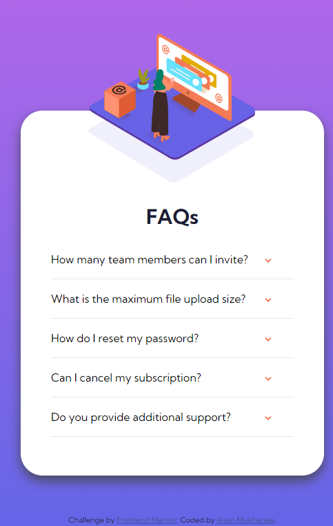

# Frontend Mentor - FAQ accordion card solution

This is a solution to the [FAQ accordion card challenge on Frontend Mentor](https://www.frontendmentor.io/challenges/faq-accordion-card-XlyjD0Oam). Frontend Mentor challenges help you improve your coding skills by building realistic projects. 

## Table of contents

- [Overview](#overview)
  - [Screenshot](#screenshot)
  - [Links](#links)
- [My process](#my-process)
  - [Built with](#built-with)
  - [What I learned](#what-i-learned)
- [Author](#author)

## Overview

### Screenshot

### Links

- Solution URL: [Solution](https://github.com/mukherjee-ayan/FAQ-Accordion-Card)
- Live Site URL: [Live Site](https://mukherjee-ayan.github.io/FAQ-Accordion-Card/)

## My process

### Built with

- Semantic HTML5 markup
- CSS custom properties
- [Bootstrap v5.1](https://getbootstrap.com/docs/5.1/getting-started/introduction/)

### What I learned

- I have learnt more about positioning.
- I have learnt about changing content of any element using CSS.
- I have learnt about after selector in CSS.
- I have learnt about positioning of background.
- I have learnt about adding event listener to any element.

## Author

- LinkedIn - [Ayan Mukherjee](https://www.linkedin.com/in/m-ayan)
- Frontend Mentor - [@mukherjee-ayan](https://www.frontendmentor.io/profile/mukherjee-ayan)
